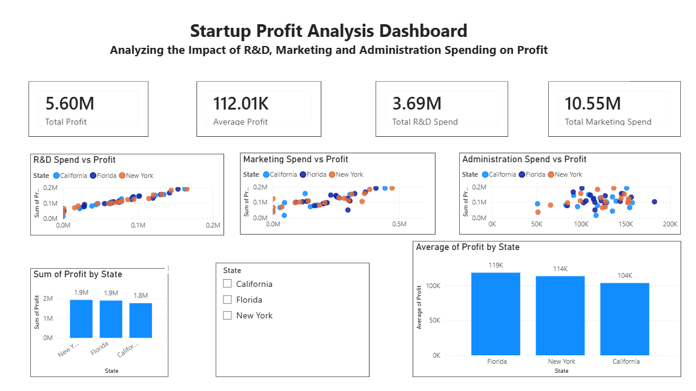
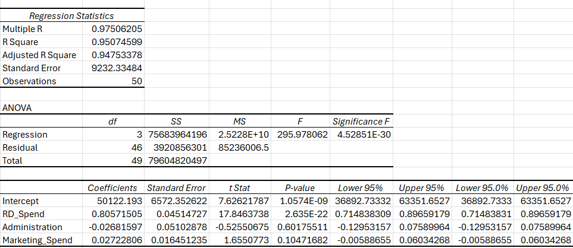
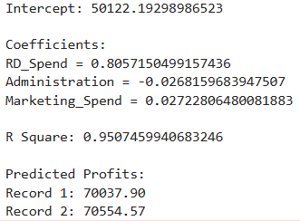

# 📊 Profit Analysis using Multiple Linear Regression

## 📌 Project Overview

This project analyzes the relationship between business spending and profit using Multiple Linear Regression. The objective is to identify how R&D, Marketing, and Administration expenses influence company profit and provide business recommendations.

---

## 🎯 Objectives

- Analyze startup expenditure data
- Build a Multiple Linear Regression model
- Predict company profit
- Create an interactive Power BI dashboard
- Generate business insights and recommendations

---

## 🛠️ Tools & Technologies

- Python
- SQL
- Microsoft Excel
- Power BI
- Machine Learning

---

## 📈 Project Features

✔ Data Cleaning

✔ Regression Analysis

✔ Profit Prediction

✔ KPI Dashboard

✔ Interactive Visualizations

✔ Business Recommendations

---

## 📊 Dashboard

### Power BI Dashboard

---

### Excel Regression Output

---

### Python Regression Output

---

## 📂 Project Files

- Report
- Presentation
- Python Code
- Power BI Dashboard
- Dataset

---

## 📬 Contact

LinkedIn:
https://www.linkedin.com/in/channakeshava-s-3b5176421

GitHub:
https://github.com/YOUR_USERNAME
